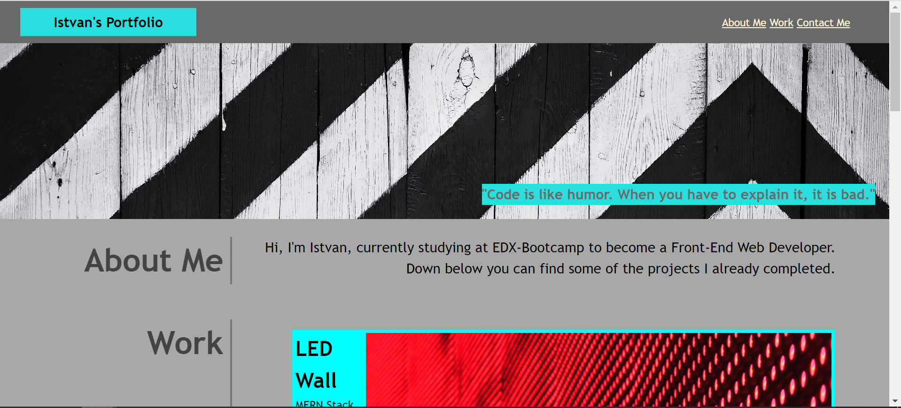
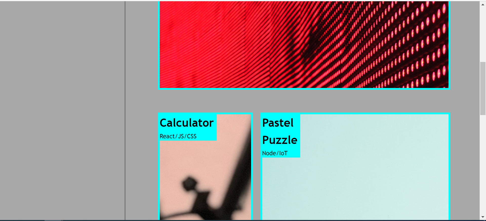
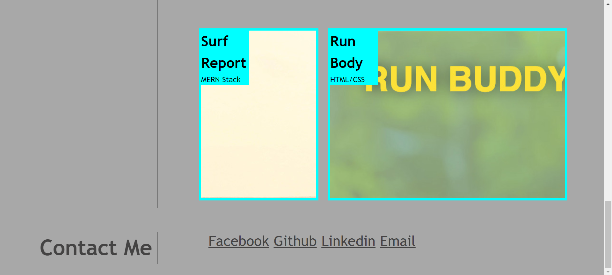

# CSS-Portfolio

## Description

In this challenge I had the opportunity to work from the starter code provided by EDX teachers. However I had to build up this Portfolio website on my own. I enjoyed working on this project because I learnt a lot on how to use CSS to style my page and how to create grids.


## Table of Contents (Optional)

If your README is long, add a table of contents to make it easy for users to find what they need.

- [Installation](#installation)
- [Usage](#usage)
- [Credits](#credits)

## Installation

No installation needed.

## Usage

Once the page is loaded, you can use the links in the navbar and it will navigate you to the relevant field.

```md
    
```
```md
    
```
```md
    
```


Deployed website: https://szeles0619.github.io/CSS-Portfolio/


## Credits

Thank you to EDX for providing the starter code and the short video how this website should look like.


